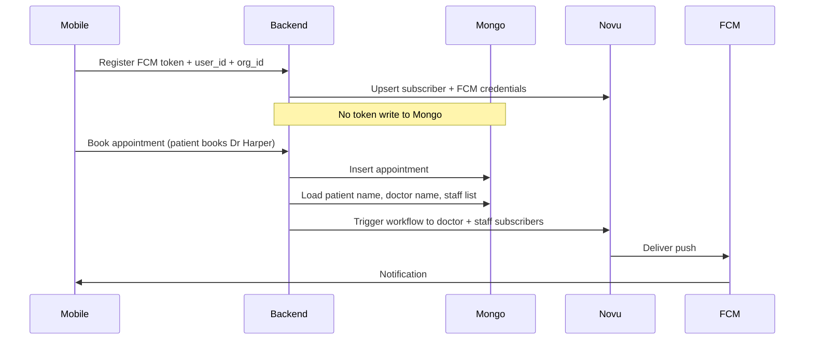

# Phase 1: Novu appointment push (planning only)

## Current baseline (what changes)

- Today, `[backend/app/routers/appointments.py](backend/app/routers/appointments.py)` inserts the appointment, reads `**device_tokens**` from Mongo, and calls `[dispatch_fcm_notification](backend/app/services/pcm_service.py)` in `[push_service.py](backend/app/services/push_service.py)` (Firebase Admin per token).
- `[backend/app/routers/providers.py](backend/app/routers/providers.py)` writes FCM tokens into Mongo via `**$addToSet` on `device_tokens**`.
- `[mobile-app/src/config/api.ts](mobile-app/src/config/api.ts)` still has `**https://example.com**` as production base URL (must become env-driven to avoid deployment footguns).

**Phase 1 direction:** keep Mongo for **business data** (patients, doctors, staff, appointments) only; **do not persist FCM tokens in Mongo**. Register and rotate tokens **only in Novu** (subscriber + push credentials APIs via backend using `NOVU_SECRET_KEY`). Trigger workflows from the same place you already insert appointments.

---

## 1) Identity and data model (Mongo, no tokens)

**Goal:** Every staff/doctor row has stable `**user_id`** (string) used as Novu `**subscriberId`**, plus `**org_id`** for future multi-tenant triggers.

- **Schema (conceptual):** extend doctor/staff documents with `user_id`, `org_id` (and keep existing `_id` if you still want ObjectId elsewhere). Align naming with your choice: **same `user_id` everywhere** (your answer B).
- **Seeding:** update `[backend/seed_db.py](backend/seed_db.py)` (or migration script) so **Dr Harper** and **at least one staff** have explicit `user_id` / `org_id` — **no random-only identities** for the demo path, or the backend cannot resolve subscribers deterministically.
- **Prototype scenario:** “one patient books Dr Harper” implies the backend must resolve **Harper’s `user_id`** and **all staff `user_id`s for that org** from Mongo (query by `org_id`), not hardcoded ObjectIds in application code.

**Avoid hardcoded data:** use **environment variables** only for *deployment* configuration (API base URL, Novu keys, workflow id, optional default `org_id` for single-tenant demo). Use **database fields** for *who is Dr Harper* (e.g. `user_id` or a flag like `is_demo_doctor`) — not scattered string literals in routers.

---

## 2) Novu cloud setup (single environment for prototype)

Per [Environments](https://docs.novu.co/platform/developer/environments) and [API Keys](https://docs.novu.co/platform/developer/api-keys):

- Use one Novu **Development** (or dedicated prototype) environment.
- Store `**NOVU_SECRET_KEY`** server-side only (Render).
- Store `**NOVU_APPLICATION_IDENTIFIER`** when you add web Inbox (Vercel); not required for push-only Phase 1.
- If you use EU region, set API/WebSocket URLs per Novu docs (see [Prepare Inbox for production](https://docs.novu.co/platform/inbox/prepare-for-production) for EU hostnames pattern; same idea applies to API client config).

**Workflow (dashboard):**

- Create **one workflow** (immutable **workflow identifier** after creation — pick carefully).
- **Step 1 — Push:** FCM integration configured in Novu Integration Store ([Push integrations](https://docs.novu.co/platform/integrations/push)).
- Template fields: title **“Appointment received”** (or your final copy); body uses payload variables for **patient name, doctor name, time** (your answer E).
- **Data payload** for mobile: include `**appointment_id`**, `**status`**, and any keys Notifee needs for styling (keep values string-safe for FCM data).

**Optional later:** add **In-app** step + Novu Inbox on web (your earlier “in-app next”); not required to close Phase 1 push loop.

---

## 3) Token registration: Novu only (no Mongo `device_tokens`)

Your requirement **C** supersedes the current `[device_tokens](backend/app/routers/providers.py)` design for Phase 1.

**Target pattern:**

1. Mobile obtains FCM token (existing RN Firebase flow).
2. Mobile calls **your** backend with `**user_id`**, `**org_id`**, `**fcm_token**`, and role hint if needed (`doctor` vs `staff`) — consistent with “device sends user id” until real auth exists.
3. Backend uses **Novu Server SDK** ([Python SDK](https://docs.novu.co/platform/sdks/server/python)):
  - **Create or update subscriber** with `subscriberId = user_id`, profile fields as needed.
  - **Update push credentials** for FCM ([Push integrations](https://docs.novu.co/platform/integrations/push) — “ahead of trigger” path).
4. **Do not** `update_one` on `device_tokens` in Mongo for this path.

**Security note:** the Novu **secret key never ships to mobile**; only the backend talks to Novu.

**Deprecation (implementation phase):** remove or gate the Mongo token path in `[providers.py](backend/app/routers/providers.py)` and remove token reads from `[appointments.py](backend/app/routers/appointments.py)` so you do not maintain two sources of truth.

---

## 4) Appointment created: trigger Novu (replace direct FCM loop)

**Hook:** immediately after successful `insert_one` in `[create_appointment](backend/app/routers/appointments.py)` (keep response fast: use `BackgroundTasks` or async fire-and-forget pattern consistent with current style).

**Recipient resolution:**

- Load **doctor** by `request.doctor_id` (existing check) and read `**user_id`**.
- Load **all staff** (or filter by `org_id` matching doctor’s `org_id`) and collect `**user_id`**s.
- **Trigger** the workflow once **per recipient subscriber** (doctor + staff), **or** use **Topics** if you prefer one trigger to a topic ([Topics](https://docs.novu.co/platform/concepts/topics)) — decision affects implementation only; for prototype, multi-trigger to explicit `subscriberId` list is simplest and matches “notify Harper + staff”.

**Payload enrichment (your answer E):**

- Resolve **patient display name** from `patient` collection by `request.patient_id`.
- Resolve **doctor display name** from `doctor` collection (you already have the doctor doc for validation).
- Pass `**appointment_time`** in ISO string for template + Notifee.

**Remove:** per-token `dispatch_fcm_notification` for **new booking** path once Novu is verified (keep or migrate status-update notifications separately if still needed in Phase 1 — specify in implementation: either both use Novu or only “appointment added” in Phase 1).

---

## 5) Duplicates and idempotency (defer detail, set policy)

You deferred **D** (double devices / person). For Phase 1 **planning**, record one policy:

- **API level:** reject duplicate booking if you introduce idempotency keys later; not mandatory for first cut.
- **Novu:** billing and semantics follow [Trigger](https://docs.novu.co/platform/concepts/trigger); “avoid duplicates” is primarily **don’t POST the appointment twice** and **don’t trigger twice for the same insert** (single trigger site after insert).

---

## 6) Mobile: Notifee + tap behavior (your E, F)

- **Notifee:** use for **display channels / styles** when the app shows the FCM notification (foreground/background handling). Payload should carry stable keys your Notifee handler maps to UI.
- **Tap:** prototype scope is **open app only** — ensure data payload includes enough to **find** the appointment later; deep linking can wait.

---

## 7) Observability (your G: logs)

- **Backend:** structured logs around: subscriber upsert, credential update, trigger call, response correlation (Novu **transaction id** per [Monitor and debug](https://docs.novu.co/platform/workflow/monitor-and-debug-workflow)).
- **Novu dashboard:** Activity Feed as primary UI for “did it run?”
- **Webhooks:** out of scope unless you upgrade plan ([Webhooks](https://docs.novu.co/platform/developer/webhooks) notes Team/Enterprise).

---

## 8) Deployment: Render (API) + Vercel (web) — config hygiene

**Render (FastAPI):**

- Env: `MONGODB_URL`, `MONGODB_DB_NAME`, `NOVU_SECRET_KEY`, `NOVU_API_URL` (if non-default), `**NOVU_WORKFLOW_ID`** (or equivalent config name), optional `DEFAULT_ORG_ID` for demo queries.
- **No** Firebase service account needed **on your server** for push **if** Novu sends via FCM only — confirm during implementation: remove or keep `[push_service.py](backend/app/services/push_service.py)` based on whether anything else still calls Firebase Admin.

**Vercel (Next.js):**

- Env: `NEXT_PUBLIC_API_URL` (or similar) for the web app; **replace** hardcoded `example.com` in `[mobile-app/src/config/api.ts](mobile-app/src/config/api.ts)` and any web client with **build-time env** so production never ships a placeholder domain.

**CORS:** allow Vercel origin on Render if the browser calls the API directly.

---

## 9) Auth stub (current state)

`[backend/app/core/auth.py](backend/app/core/auth.py)` is still a stub. Phase 1 planning: **explicit `user_id` (and `org_id`) on requests** from devices for token registration and any future protected routes; document that JWT auth replaces this later.

---

## 10) Documentation and handoff

- Extend `[documentation/NovuPrototype.md](documentation/NovuPrototype.md)` with: subscriber id strategy, no-token-in-Mongo decision, workflow id, env var list, and demo script (seed → register token via new endpoint → book appointment → verify in Novu Activity Feed + device).

---

## Suggested implementation order (when you leave planning mode)

1. Novu dashboard: FCM integration + workflow + templates.
2. Mongo: add `user_id` / `org_id`; seed Harper + staff deterministically.
3. Backend: Novu client + subscriber/credential endpoint (Mongo-free tokens).
4. Backend: appointment create triggers Novu; enrich names/time; remove Mongo token reads for that path.
5. Mobile: point API URL to Render via env; call new registration endpoint; Notifee mapping.
6. Deploy Render + Vercel; smoke test with logs + Activity Feed.

## **What we will do and why**

### **1) Align identity:** `user_id` **→ Novu** `subscriberId`

**What:** Ensure the backend can resolve a **single string** that Novu will use as `subscriberId` (Novu’s canonical recipient id per [Subscribers](https://docs.novu.co/platform/concepts/subscribers)).

**Why:** Today the API treats `owner_id` as **Mongo** `ObjectId`. Your product decision is `user_id` **= subscriberId**. Without a defined mapping (DB field or request field), Novu and Mongo will drift.

**Likely shape:** After validating the doctor/staff document, **read** `user_id` **from that document** (once you add it to Mongo) **or** accept `user_id` in the body only if you still verify it against the loaded document. **Why:** avoids trusting the client blindly while still using `user_id` in Novu.

---

### **2) Extend settings for Novu (minimal, real needs)** — DONE (config + logging + `.env.example`)

**What:** In `backend/app/core/config.py`, add only what the code will read: optional **API base URL** (US vs EU—`novu-py` passes this as `server_url`; EU example `https://eu.api.novu.co`), optional `NOVU_FCM_INTEGRATION_IDENTIFIER` if your Novu project has a named FCM integration ([Push](https://docs.novu.co/platform/integrations/push)). `NOVU_SECRET_KEY` is **required** (non-empty) at settings load time.

**Why:** Secret key alone is enough for US default; EU or multiple FCM integrations need explicit config.

**Step 2 completion checklist (before Step 3):**

- `NOVU_SECRET_KEY` is set in `.env` (local) or the host secret store (Render, etc.); value is non-empty and not shipped to mobile or frontend.
- If the Novu project is in **EU**, set `NOVU_SERVER_URL=https://eu.api.novu.co` (or the host your dashboard documents); otherwise omit for US default.
- If the Novu workspace has **more than one FCM integration**, set `NOVU_FCM_INTEGRATION_IDENTIFIER` to the integration identifier from the dashboard; otherwise omit.
- Start the API (`uvicorn app.main:app --reload`) and confirm a startup line like `Novu: API base …; FCM integration …` with no validation error from `Settings`.
- Optional: set logging to DEBUG and confirm `Novu settings detail:` includes the resolved optional fields (never logs the secret).

---

### **3) Add a small Novu integration module (single responsibility)** — DONE (`app/services/novu_subscribers.py`)

**What:** New module (e.g. `app/services/novu_subscribers.py` or similar) that wraps `novu-py`:

- **Create or update subscriber** with `subscriber_id=<user_id>` and optional profile fields (name from Mongo if useful).
- **Upsert FCM credentials** via the SDK’s subscriber credentials **append** path (`credentials.append_async` → PATCH; Novu **Upsert provider credentials** / append tokens: [API ref](https://docs.novu.co/api-reference/subscribers/upsert-provider-credentials)).

**Why:** Keeps `providers.py` thin; centralizes auth (`NOVU_SECRET_KEY`), error handling, logging, and future reuse (e.g. appointment triggers).

**Implementation notes:** Single cached `Novu` client (`_novu_client`), `sync_subscriber_fcm_to_novu(user_id=..., fcm_token=..., display_name=...)`: `subscribers.create_async` then `subscribers.credentials.append_async` with `providerId` `fcm`, optional `integrationIdentifier` from `NOVU_FCM_INTEGRATION_IDENTIFIER`. Novu failures → `AppException` `NOVU_API_ERROR` / 502; details logged (no full FCM token in error logs).

**Step 3 completion checklist (paste outputs for verification):**

- `python -c "from app.services.novu_subscribers import sync_subscriber_fcm_to_novu; print('import_ok')"` from `backend/` prints `import_ok` with no `ModuleNotFoundError` / `novu_py` errors.
- Optional: `await sync_subscriber_fcm_to_novu(user_id="<uuid from Mongo>", fcm_token="<real FCM token>", display_name="Dr …")` (e.g. short asyncio script) returns `None` and logs `Novu: subscriber + FCM credentials synced`.
- On intentional bad secret: startup still works; the above call logs `Novu API error` and raises `AppException` / HTTP 502 with code `NOVU_API_ERROR` if wired to an endpoint.
- Novu dashboard: subscriber appears with `subscriberId` = your `user_id`; push / credentials show the device token after a successful sync.
- With logging level DEBUG, log lines include `Novu: create/upsert subscriber` and `Novu: append FCM credentials` (token prefix only, not full token).

---

### **4) Wire the existing PATCH handler** — DONE (`providers.py` + `PERSIST_DEVICE_TOKENS_IN_MONGO`)

**What:** In `update_provider_fcm_token`, **after** Mongo validation succeeds, call the Novu module: upsert subscriber + FCM token for `subscriberId = user_id`.

**Why:** Same HTTP contract the mobile app already uses; no new mobile endpoint required for this slice.

**Also decided:**

- **Default:** no Mongo `device_tokens` write. **Optional:** `PERSIST_DEVICE_TOKENS_IN_MONGO=true` restores legacy `$addToSet` for rollback / parallel runs. **Why:** Novu is source of truth; dual writes invite bugs.

**Step 4 completion checklist (before Step 5 — appointment trigger / Mongo token reads):**

- `PATCH /api/v1/providers/me/fcm-token` with valid Mongo `owner_id` (ObjectId) + `fcm_token` returns **200** and JSON includes `user_id` (UUID) and success message.
- Novu failure returns **502**, `code` `**NOVU_API_ERROR`** (not a false 200); server logs `Novu API error` with step + `user_id`.
- Novu dashboard: subscriber `**subscriberId`** matches Mongo `user_id`; FCM credentials show the token after success.
- With `**PERSIST_DEVICE_TOKENS_IN_MONGO**` unset or **false**, Mongo `device_tokens` is **not** updated for that call (confirm with a DB query or logs: no `legacy device_tokens write` DEBUG unless flag on).
- With flag **true**, legacy `device_tokens` document still updates (optional rollback path).
- **Known follow-up:** `appointments.py` may still read `device_tokens` / `dispatch_fcm_notification` until Step 5 migration — booking push is independent of this PATCH verification.

---

### **5) Request schema**

**What:** Extend `FcmTokenUpdateRequest` only if needed—e.g. optional `user_id` **only** if the server cannot yet read it from Mongo; otherwise **no** new field and **derive** `user_id` from the doctor/staff document.

**Why:** Schema should match the real source of truth for `subscriberId` and avoid redundant/conflicting ids.

---

### **6) Error handling and logging**

**What:** If `NOVU_SECRET_KEY` is missing, return a clear **503/500** with a stable error code; log Novu failures without logging full FCM tokens.

**Why:** Fails fast in dev/deploy; avoids silent “success” when Novu didn’t update.

---

### **7) Dependencies**

**What:** Rely on `novu-py` only for this feature; remove or ignore the legacy `novu` package if it’s unused **Why:** one client, predictable API ([Python SDK](https://docs.novu.co/platform/sdks/server/python)).

---

### **8) Explicitly out of this feature**

**What:** Do **not** change `appointments.py` or Firebase `push_service.py` in this slice.

**Why:** This plan is **token registration → Novu only**; booking triggers are a separate change.

---

## **Implementation order (backend)**

1. `user_id` on doctor/staff + seed/data (if not present) so the server can resolve `subscriberId`.
2. Config fields + `.env` documentation.
3. Novu service module (subscriber + FCM credential upsert).
4. PATCH handler: call Novu; remove or gate Mongo `device_tokens`.
5. Manual test: register token → confirm subscriber + credentials in Novu dashboard / API.

---

No code in this message—this is the backend plan only.